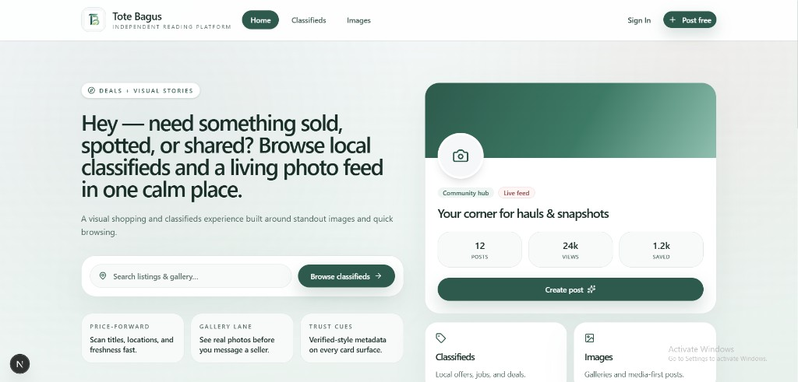
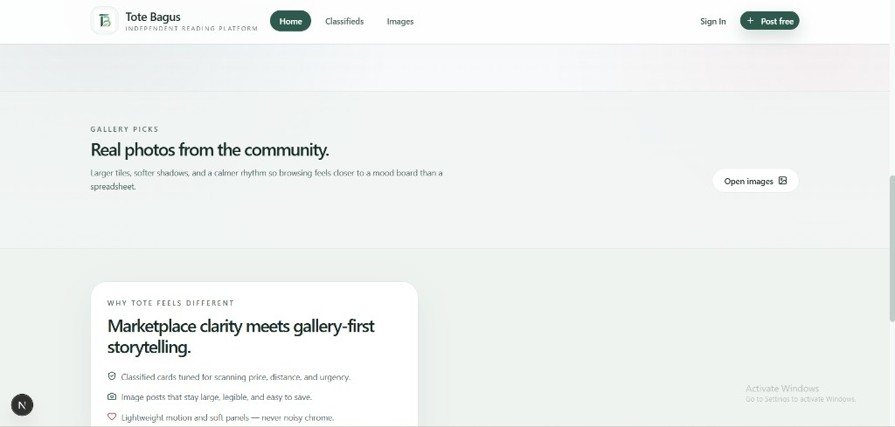
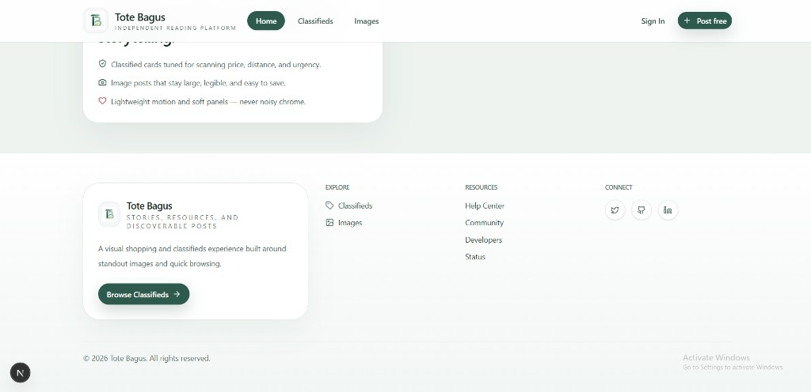
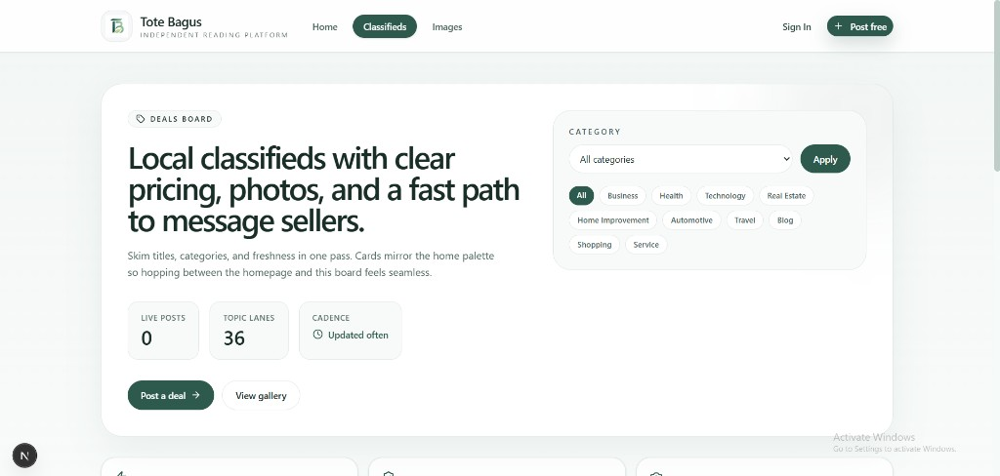
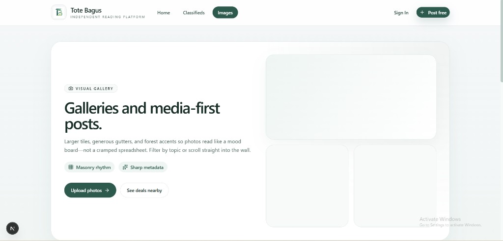
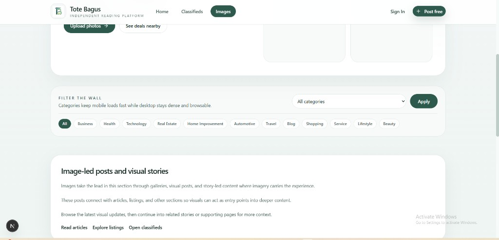
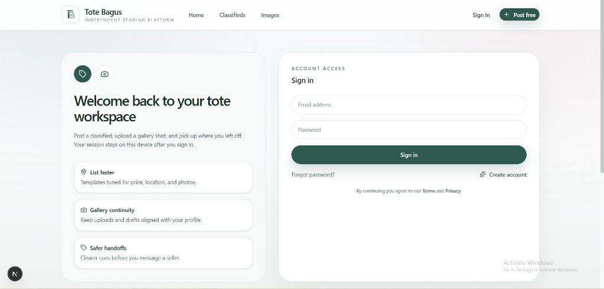

# Tote Bagus

Next.js site for local **classifieds** and **image** posts, with a calm forest-and-mist UI.

## UI screenshots

Images below are stored in this repo under [`docs/screenshots/`](docs/screenshots/) so they render inline on GitHub.

### Home — hero



### Home — gallery picks



### Home — header and footer



### Classifieds



### Images — hero



### Images — filters and intro



### Sign in



## Development

```bash
pnpm install
pnpm dev
```

Open [http://localhost:3000](http://localhost:3000).
